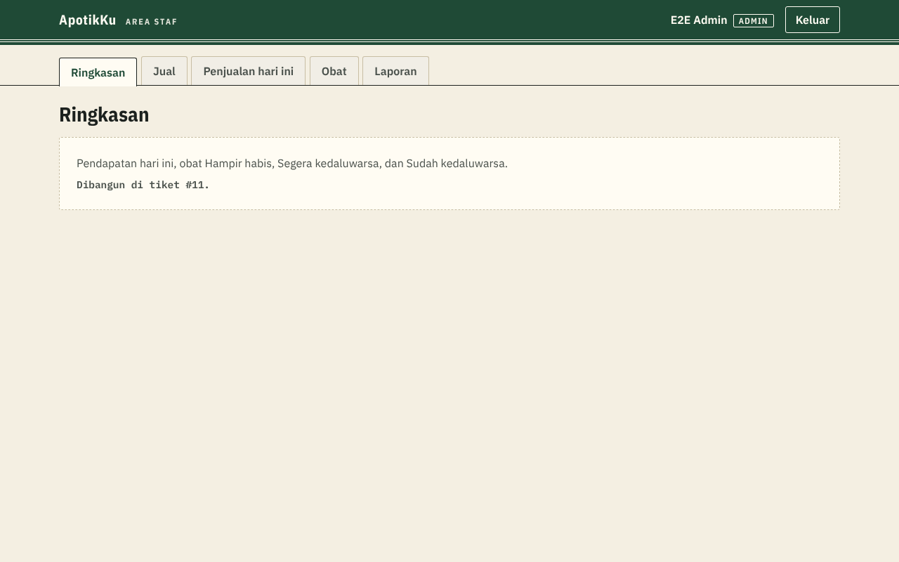
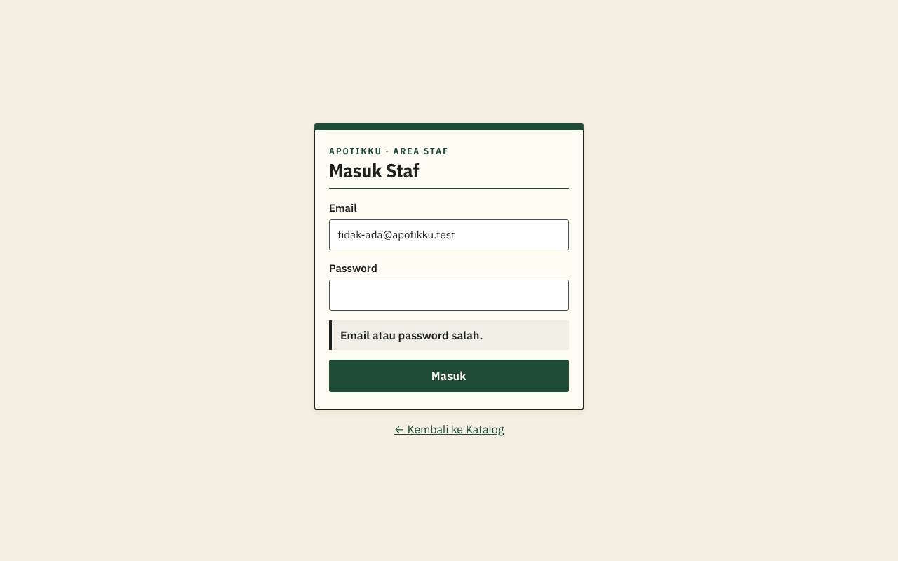
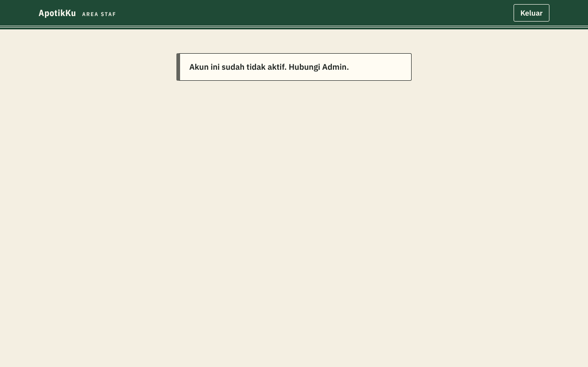

# Penjelasan kode: Login dan logout Staf (tiket #6)

> Dokumen ini menjelaskan kode tiket #6 untuk orang yang belum pernah membuat aplikasi web. Istilah domain (Staf, Admin, Kasir, Area staf) mengikuti [`CONTEXT.md`](../../CONTEXT.md). Istilah teknis lain ada di kamus [`KENAPA.md`](../KENAPA.md#kamus-istilah-teknis). Penjelasan Katalog ada di [`01-katalog.md`](01-katalog.md).

## 1. Tiga penjaga, tiga tugas

ApotikKu dijaga berlapis (ADR 0003). Setiap lapis punya satu tugas, dan **hanya lapis terakhir yang wajib tidak pernah salah**.

| Lapis | File | Tugas | Kalau lapis ini bocor… |
|---|---|---|---|
| 1. Proxy | `proxy.ts` | Orang yang belum login dari `/staf/*` diarahkan ke `/masuk` | Halaman Staf terbuka, tetapi datanya kosong karena ditolak database |
| 2. Pengecek Staf | `lib/staf.ts` | Membaca profil Staf: nama, peran, aktif atau tidak. Menampilkan menu sesuai peran. Kasir yang membuka halaman Admin diarahkan ke Jual | Kasir melihat halaman Admin, tetapi datanya tetap ditolak database |
| 3. **RLS di database** | `supabase/migrations/20261010084330_login_staf.sql` | Menentukan baris mana yang boleh dibaca siapa | Ini yang tidak boleh bocor, maka diuji otomatis |

*Analogi:* gedung kantor. Satpam di pintu (proxy) hanya mengecek "punya kartu atau tidak". Resepsionis (pengecek Staf) melihat kartumu dan menunjukkan ruangan yang boleh kamu datangi. Tetapi yang benar-benar menjaga isi lemari arsip adalah **kunci di setiap lemari** (RLS). Kalau satpam lengah, lemari tetap terkunci.

## 2. Apa yang terjadi saat Staf masuk

```
Browser ──1── /masuk (email + password) ──2──▶ Server Next.js ──3──▶ Supabase Auth
   ▲                                              │                      │
   │                                              ◀──4── token login ────┘
   └───────5── cookie + pindah ke /staf ──────────┘
                     │
                     6── /staf → Kasir: /staf/jual, Admin: /staf/ringkasan
```

1. Staf mengisi email dan password di halaman `/masuk`.
2. Formulir dikirim ke server kita (**Server Action** di `app/masuk/aksi.ts`), bukan langsung dari browser ke Supabase.
3. Server meneruskan email dan password ke Supabase Auth. Supabase menyimpan password dalam bentuk **hash** (diacak satu arah), jadi kita tidak pernah menyimpan password sendiri. Ini memperbaiki kelemahan versi 1.
4. Bila cocok, Supabase memberi **token login**: tanda bukti bertanda tangan digital yang berumur pendek.
5. Server menyimpan token itu di **cookie**, lalu memindahkan browser ke `/staf`.
6. `/staf` membaca profil Staf dan mengarahkan sesuai peran (user story 23).

Bila gagal, pesannya **selalu** "Email atau password salah.", baik passwordnya yang salah maupun emailnya yang tidak terdaftar (user story 22). Kalau pesannya berbeda ("email tidak ditemukan"), orang asing bisa menebak-nebak email mana milik Staf. Pengecualiannya satu: bila server Supabase sedang bermasalah, pesannya "Sedang tidak bisa masuk. Coba lagi sebentar lagi." Pesan ini tidak membocorkan apa pun, tetapi mencegah Staf mengira passwordnya salah.

## 3. Proxy: satpam yang sengaja sedikit tugasnya

`proxy.ts` berjalan **sebelum** halaman `/staf/*` atau `/masuk` dibuka:

- **Memperbarui sesi.** Token login hanya berlaku sebentar. Bila sudah lewat, proxy menukarnya dengan token baru dan menulis ulang cookie. Karena itu Staf tetap masuk walaupun halaman dimuat ulang atau dibuka lagi setelah istirahat (user story 25).
- **Belum login + buka `/staf/*`** → diarahkan ke `/masuk` (user story 26).
- **Sudah login + buka `/masuk`** → diarahkan ke `/staf`.
- **Halaman Staf diberi tanda "jangan disimpan"** (`Cache-Control: no-store`), supaya browser tidak menyimpan salinannya.

Proxy **tidak** mengecek peran. Untuk tahu peran, proxy harus bertanya ke database, sedangkan panduan resmi Next.js 16 menyebut proxy bukan tempat mengambil data dan tidak boleh menjadi satu-satunya penentu hak akses. Proxy cukup memeriksa tanda tangan token, yang bisa dilakukan tanpa bertanya ke database, jadi cepat.

Proxy juga **tidak berjalan di Katalog**. Pengunjung tidak punya sesi, jadi tidak ada gunanya menunggu pemeriksaan login.

## 4. Pengecek Staf: satu tempat untuk "siapa kamu, boleh ke mana"

`lib/staf.ts` berisi tiga fungsi yang dipanggil halaman Staf:

| Fungsi | Dipakai di | Yang dilakukan |
|---|---|---|
| `ambilStaf()` | Semua di bawah | Memeriksa token login, lalu membaca profil Staf dari tabel `profil_staf`. Dibaca sekali saja per halaman walau ditanya beberapa kali |
| `wajibStaf()` | Semua halaman `/staf/*` | Belum login → `/masuk` |
| `wajibAdmin()` | Ringkasan, Obat, Laporan | Kasir → `/staf/jual` |

Kerangka bersama Area staf (`app/staf/layout.tsx`) memakai profil itu untuk menampilkan:
- pita hijau berisi nama tampilan, peran, dan tombol Keluar;
- menu sesuai peran (`components/staf/MenuStaf.tsx`): Kasir hanya melihat **Jual** dan **Penjualan hari ini**; Admin melihat **Ringkasan, Jual, Penjualan hari ini, Obat, Laporan**;
- untuk Staf nonaktif: hanya pesan "Akun ini sudah tidak aktif. Hubungi Admin." dan tombol Keluar.



Halaman Jual, Penjualan hari ini, Ringkasan, Obat, dan Laporan untuk sementara berisi **kerangka** dengan keterangan tiket yang akan mengisinya (#8, #10, #11, #9, #12).

## 5. Keluar: kenapa memuat ulang seluruh halaman

Tombol Keluar mengirim formulir biasa ke `POST /keluar` (`app/keluar/route.ts`, sebuah **Route Handler**). Di sana:

1. Sesi di perangkat ini diakhiri di server Supabase, dan cookie-nya dihapus (user story 24, kelemahan v1 no. 3).
2. Browser diarahkan ke `/masuk?keluar=1` dengan **muat ulang penuh**, lalu muncul pesan "Kamu sudah keluar."

**Kenapa harus muat ulang penuh?** Hal ini ditemukan saat menguji di browser sungguhan. Next.js 16 punya fitur **Activity**: halaman yang baru dikunjungi tidak dibuang, tetapi disembunyikan di memori browser supaya tombol Kembali terasa instan. Pada percobaan pertama, Keluar memakai Server Action (pindah halaman tanpa muat ulang). Hasilnya, setelah keluar, halaman `/masuk` masih menyimpan pita "Kasir Uji" yang tersembunyi. Sekarang isinya baru nama. Nanti, setelah tiket #10, isinya bisa daftar Penjualan hari ini. Di komputer kasir yang dipakai bergantian, itu kebocoran.

*Analogi:* Kasir pulang dan menutup buku catatannya, tetapi bukunya masih tergeletak di meja; kasir berikutnya tinggal membukanya. Muat ulang penuh sama dengan **membereskan meja**: semua yang tersimpan di memori browser dibuang.

Setelah perbaikan, tes di browser memastikan teks nama Kasir tidak tersisa di halaman setelah Keluar, dan tombol Kembali hanya membawa ke `/masuk`.

Dua keputusan kecil lain:
- **Hanya perangkat ini yang dikeluarkan** (`scope: "local"`). Admin yang login di laptop dan tablet tidak ikut terlempar dari tablet saat keluar di laptop.
- **Hanya menerima kiriman dari ApotikKu sendiri.** Bila formulir datang dari situs lain, `/keluar` menolak (kode 403), supaya situs iseng tidak bisa diam-diam mengeluarkan Staf.

## 6. Database: profil Staf dan aturannya

### Tabel `profil_staf`

Akun login (email + password) disimpan Supabase. Tabel ini menambahkan hal yang khusus ApotikKu: `nama_tampilan` ("Kasir 1"), `peran` (`admin` atau `kasir`), dan `aktif`.

Staf yang berhenti **tidak dihapus**, cukup `aktif` dimatikan (aturan bisnis 7). Database bahkan menolak penghapusan akun login yang masih punya profil, supaya riwayat Penjualannya nanti tidak kehilangan pemilik.

### Fungsi `peran_saya()`

Menjawab "Staf yang sedang login ini perannya apa?" Jawabannya `admin`, `kasir`, atau **kosong** untuk Pengunjung dan Staf nonaktif. Semua aturan RLS memakainya.

- Tinggal di skema **`private`** (ruang belakang), sama seperti `status_stok`. Supabase hanya membuka skema `public` ke internet, jadi fungsi ini tidak bisa dipanggil langsung dari luar. Tes membuktikannya.
- Berjalan sebagai **security definer** (dengan hak pemilik fungsi). Ini perlu karena aturan RLS tabel `profil_staf` sendiri memanggil fungsi ini. Tanpa itu, fungsi akan terkena aturan yang sedang dicek dan berputar tanpa ujung. Fungsi ini aman karena hanya pernah mengembalikan peran **milik pemanggilnya**.

### Aturan RLS

| Data | Pengunjung | Kasir | Admin | Staf nonaktif |
|---|:-:|:-:|:-:|:-:|
| `profil_staf`, baca | ❌ | miliknya | semua | miliknya (untuk pesan nonaktif) |
| `profil_staf`, tambah/ubah/hapus | ❌ | ❌ | ❌ | ❌ |
| `obat`, baca | ❌ | yang tidak diarsipkan | semua | ❌ |
| `obat`, tambah/ubah/hapus | ❌ | ❌ | ❌ (dibuka di #9) | ❌ |

Admin pun tidak bisa mengubah `profil_staf` dari aplikasi. Akun dikelola lewat dasbor Supabase sampai milestone 2. Dengan begitu, Kasir yang mengakali browser tidak mungkin menaikkan perannya sendiri menjadi Admin.

### Merapikan fungsi bawaan `rls_auto_enable()`

Supabase punya pengaturan "automatic RLS" yang menyalakan RLS otomatis setiap ada tabel baru. Pengaturan ini membuat fungsi `public.rls_auto_enable()` yang berjalan dengan hak penuh. Karena fungsi itu ada di skema `public`, ia ikut terbuka sebagai alamat API yang bisa dipanggil siapa pun. Pemeriksa keamanan Supabase memberi dua peringatan untuk ini.

Migrasi mencabut izin memanggilnya dari `anon` (Pengunjung) dan `authenticated` (Staf). Sebelum dicabut, panggilan Pengunjung lolos pemeriksaan izin dan baru gagal di langkah berikutnya (kode `0A000`). Sesudahnya, panggilan langsung ditolak di pintu (kode `42501`, izin ditolak). Pemicu otomatisnya **tetap bekerja**: sudah dicoba dengan membuat tabel percobaan (RLS-nya menyala), lalu tabel itu dibatalkan.

## 7. Tes otomatis

`tests/staf.test.ts` login sungguhan sebagai tiga akun uji di project `apotikku-uji`, lalu mencoba hal-hal yang boleh dan yang tidak boleh:

- password salah dan email tidak terdaftar mendapat jawaban yang sama;
- pendaftaran akun umum tertutup (dibaca dari pengaturan Auth);
- Kasir hanya membaca profilnya sendiri, Admin membaca semua, Staf nonaktif hanya profilnya sendiri, Pengunjung tidak sama sekali;
- tidak ada yang bisa mengubah profil Staf, termasuk Kasir yang mencoba menjadi Admin dan Staf nonaktif yang mencoba mengaktifkan diri;
- Kasir membaca obat yang tidak diarsipkan (dengan angka stok persis) tetapi tidak bisa mengubah, menambah, atau menghapusnya; Admin membaca semua;
- Staf nonaktif tidak bisa membaca obat (bukti `peran_saya` kosong);
- `peran_saya` dan `rls_auto_enable` tidak bisa dipanggil lewat API.

**Kesalahan yang ditemukan saat menulis tes.** Tes "pendaftaran tertutup" mula-mula mencoba mendaftar dengan email `@apotikku.test`, dan tes itu lulus. Ternyata Supabase menolak domain `.test` sebagai email tidak valid, padahal pendaftaran sebenarnya **masih terbuka**. Tes yang lulus karena alasan yang salah lebih berbahaya daripada tes yang gagal, jadi tesnya diganti: sekarang membaca langsung pengaturan `disable_signup` dari Supabase.

**Uji di browser (manual dengan alat, tidak ikut CI).** Alur lengkap dicoba di Chromium terhadap build produksi lokal, memakai tiga akun sementara di project uji yang langsung dihapus setelahnya. Ada 21 pemeriksaan, semuanya lulus: arah setelah masuk, menu tiap peran, Kasir diusir dari Ringkasan/Laporan, sesi bertahan saat dimuat ulang, Keluar menghapus cookie dan sisa halaman, tombol Kembali, Staf nonaktif, dan tautan "Masuk Staf" di Katalog.

| Gagal masuk | Staf nonaktif |
|---|---|
|  |  |

## 8. Menyiapkan akun Staf (sekali, oleh pemilik project)

Lakukan di **kedua** project (`apotikku` dan `apotikku-uji`) lewat dasbor Supabase:

1. **Matikan pendaftaran umum**: Authentication → Sign In / Providers → matikan **Allow new users to sign up** → Save.
2. **Buat akun**: Authentication → Users → **Add user** → **Create new user**, isi email dan password, centang **Auto Confirm User**.
   - `apotikku`: `admin@apotikku.test`, `kasir@apotikku.test`
   - `apotikku-uji`: ketiganya ditambah `nonaktif@apotikku.test`
3. **Pasang profilnya**: SQL Editor → jalankan `supabase/data/profil-staf.sql` (project asli) atau bagian "Profil Staf uji" di `supabase/uji/data-uji.sql` (project uji).
4. **Simpan password uji** (project uji saja) di pengelola password kamu, lalu salin ke:
   - GitHub → repo → Settings → Secrets and variables → Actions → **New repository secret**: `SUPABASE_UJI_ADMIN_PASSWORD`, `SUPABASE_UJI_KASIR_PASSWORD`, `SUPABASE_UJI_NONAKTIF_PASSWORD`;
   - `.env.local` di laptop (nama variabel sama, contohnya di `.env.example`).

Password **tidak pernah** ditulis di repo atau dikirim lewat chat.

## Kalau dosen bertanya…

**"Kenapa tidak membuat sistem login sendiri?"**
Bagian tersulit login (menyimpan password dengan hash, token yang kedaluwarsa, membatasi percobaan berulang) sudah dikerjakan Supabase Auth dan diuji banyak orang. Di bagian inilah versi 1 gagal: password tidak teracak dan login bisa dilewati. Kami cukup memakai dan mengujinya.

**"Kalau cookie dicuri atau diubah, bagaimana?"**
Token di cookie bertanda tangan digital. Mengubah isinya (misalnya mengganti id pengguna) membuat tanda tangannya tidak cocok, sehingga ditolak oleh `getClaims()` di server maupun oleh database. Token juga berumur pendek dan dihapus saat Keluar.

**"Kenapa Staf nonaktif masih bisa login?"**
Login ditangani Supabase Auth, yang tidak tahu soal kolom `aktif` milik kami. Yang penting, setelah login ia tidak bisa membaca atau mengubah apa pun, karena `peran_saya()` mengembalikan kosong untuk akun nonaktif, dan itu diuji. Halaman cukup memberi tahu dengan jelas: "Akun ini sudah tidak aktif. Hubungi Admin."

**"Menu Kasir disembunyikan, apa itu cukup?"**
Tidak, dan memang tidak diandalkan. Menyembunyikan menu hanya soal kenyamanan. Kalau Kasir mengetik alamat `/staf/laporan`, ia diarahkan ke Jual. Kalau ia mengakali browser untuk meminta data langsung, database yang menolak (RLS), dan itu diuji otomatis.

**"Kenapa ada tautan Masuk Staf di Katalog? Bukankah lebih aman disembunyikan?"**
Menyembunyikan alamat bukan pengamanan; alamat mudah ditebak. Yang mengamankan adalah login dan RLS. Tautan kecil itu memudahkan Staf membuka Area staf dari HP atau tablet mana pun.
